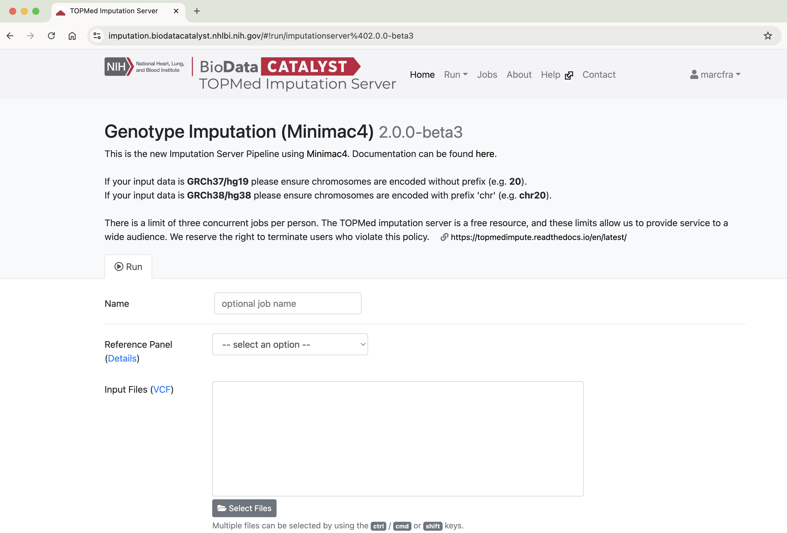
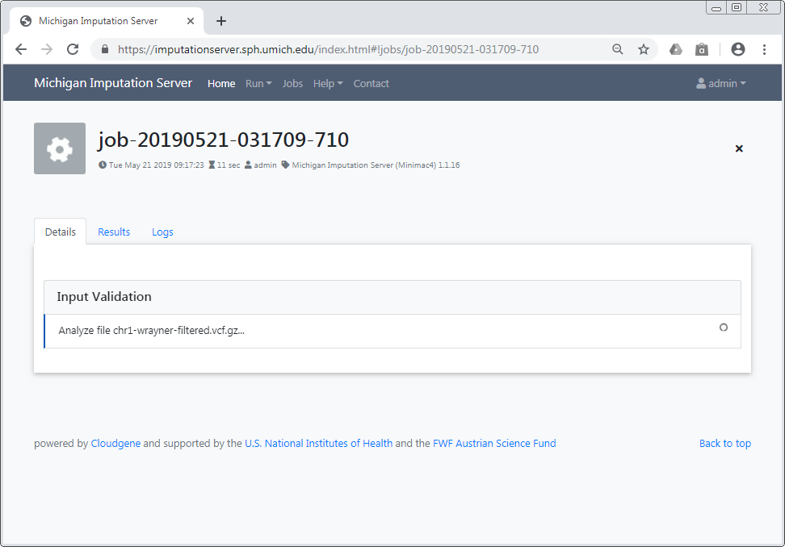

# Getting Started

To use the TOPMed Imputation Server, [registration](https://imputation.biodatacatalyst.nhlbi.nih.gov/index.html#!pages/register) is required. We will send an activation email to the provided address. Please follow the instructions in the email to activate your account. If the email does not arrive, ensure you have entered the correct address and check your spam folder.

**After the email address has been verified, the service can be used without any costs.**

Please cite the following papers if you use the TOPMed Imputation Server:

* TOPMed Study:
  > [Taliun, D. et al. (2019) Sequencing of 53,831 diverse genomes from the NHLBI TOPMed Program. Biorxiv, doi:10.1101/563866](https://www.biorxiv.org/content/10.1101/563866v1)
* Imputation Server:
  > [Das S, Forer L, Schönherr S, Sidore C, Locke AE, Kwong A, Vrieze S, Chew EY, Levy S, McGue M, Schlessinger D, Stambolian D, Loh PR, Iacono WG, Swaroop A, Scott LJ, Cucca F, Kronenberg F, Boehnke M, Abecasis GR, Fuchsberger C. Next-generation genotype imputation service and methods. Nature Genetics 48, 1284–1287 (2016).](https://www.ncbi.nlm.nih.gov/pubmed/27571263)
* Minimac Imputation:
  > [Fuchsberger, C., Abecasis, G. R., & Hinds, D. A. (2014). minimac2: faster genotype imputation. Bioinformatics, 31(5), 782–784.](https://doi.org/10.1093/bioinformatics/btu704)

## Set Up Your First Imputation Job

Please [log in](https://imputation.biodatacatalyst.nhlbi.nih.gov/index.html#!pages/login) with your credentials and click on the **Run** tab to start a new imputation job. The submission dialog allows you to specify the properties of your imputation job.

The following options are available:

### Reference Panels

#### TOPMed Imputation Server

The TOPMed Imputation Server offers genotype imputation for the TOPMed reference panel, which is the largest and most accurate panel available amongst the two imputation servers.

- TOPMed (Version r3 2023)

See the [reference panel documentation](reference-panel.md) for details.

#### Michigan Imputation Server

The Michigan Imputation Server is a separate service with several additional reference panels available.  Consult the relevant [documentation](https://genepi.github.io/michigan-imputationserver/reference-panels/) for details.

### Upload VCF Files From Your Computer

The Input Files dialog lets you choose VCF files for imputation. When you submit the job, all the selected files will be transferred from your local file system to the TOPMed Imputation Server. By clicking on **Select Files**, an open dialog will appear where you can choose your VCF files.

You can select multiple files by holding down the Ctrl, Cmd, or Shift key, depending on your operating system. After confirming your selection, all chosen files will be listed in the Input Files dialog.

Please ensure that all files meet the [requirements](data-preparation.md).

!!! important
    Since version 1.7.2 URL-based uploads (`sftp` and `http(s)`) are no longer supported. Please use direct file uploads instead.

### Build

Please select the build of your data. Currently, the supported options are **hg19** and **hg38**. The TOPMed reference panel is based on **hg38** coordinates; if you submit **hg19**, the server will automatically update the genome positions of your data (liftOver).

### rsq Filter

To minimize the file size, the TOPMed Imputation Server includes an r2 filter option that excludes all imputed SNPs with an r2-value (imputation quality) smaller than the specified threshold.

### Phasing

If your uploaded data is unphased, Eagle v2.4.1 will be used for phasing. If your VCF file already contains phased genotypes, please select the “No phasing” option.

!!! important
    Michigan Imputation Server 2 will rephase your data if a phasing engine is selected.

|  Algorithm | Description |
| ---------- |-------------|
| **Eagle v2.4.1** | The [Eagle](https://data.broadinstitute.org/alkesgroup/Eagle/) algorithm estimates haplotype phase using the HRC reference panel. After phasing or imputation you will receive phased genotypes in your VCF files. |

### Allele Frequency Check

Please select whether to compare allele frequencies between your data and the reference panel.

In case your samples are mixed from different populations, please select **Skip** to skip the allele frequency check. For mixed populations, no QC-Report will be created.

!!! note
    In previous versions, this paramter was called "Population".

### Mode

Please select if you want to run **Quality Control & Imputation** or **Quality Control Only**.

!!! important
    Results (e.g. QC Report) will be available only after the entire job is complete.

### AES 256 Encryption

All imputed genes are returned as encrypted ZIP files. If you select the **AES 256 Encryption** option, we will use the stronger AES 256 encryption protocol instead of the default method. Note that AES encryption is not compatible with standard unzip programs. If this option is selected, we recommend using [7-zip](https://www.7-zip.org/download.html) to access your results.

## Start Your Imputation Job

After confirming our **Terms of Service**, you can submit your imputation job by clicking **Start Imputation**. If your data passes the QC steps, your job will be added to the queue and processed as soon as possible. You can check your position in the queue on the job summary page.

We will notify you by email as soon as the job is finished or if your data does not pass the quality control steps.

### Input Validation

In the first step, we check if your uploaded files are valid and calculate basic statistics, such as the number of samples, chromosomes, and SNPs.

After the input validation is complete, basic statistics can be viewed directly in the web interface.

If you encounter problems with your data, please read this tutorial on [Data Preparation](data-preparation.md) to ensure your data is in the correct format.

### Quality Control

In this step, we check each variant and exclude it if it meets any of the following criteria:

1. contains invalid alleles
2. duplicates
3. indels
4. monomorphic sites
5. allele mismatch between reference panel and uploaded data
6. SNP call rate < 90%
7. Strand flips and allele swaps

All filtered variants are listed in a file called `statistics.txt`, which can be downloaded by clicking the provided link.

!!! important
    Due to changes in Minimac 4, Michigan Imputation Server 2 now includes filtering and checks for allele swaps. For more information, please click [here](./qc-allele-swaps.md).

If you selected a population, we compare the allele frequencies of the uploaded data with those from the reference panel. The results of this check are available in the QC report and can be downloaded by clicking on `qcreport.html`.

### Pre-Phasing and Imputation

Imputation is achieved with Minimac4 (version 4.1.6).

### Data Compression and Encryption

If imputation is successful, we will compress and encrypt your data, and send you a random password via email.

!!! important  "Password not stored at any time"
     **This password is not stored on our server at any time.** Therefore, if you lost the password, there is no way to resend it to you.

## Download Results

You will be notified by email as soon as the imputation job is complete. For each submitted gene, a ZIP archive containing the imputed results can be downloaded directly from the server. To decrypt the results, a one-time password will be generated by the server and included in the email. The QC report and filter statistics are also available for viewing and download.

!!! important "All data is deleted automatically after 7 days"
      **Be sure to download all required data within 7 calendar days!** We will send you a reminder 48 hours before your data is deleted. Once your job reaches the **retired** state, we will not be able to recover your data.

###  Download Via a Web Browser

All results can be downloaded directly through your browser by clicking on the filename.

If you wish to download results via the command line using `wget` or `curl`, click on the download icon to obtain download links. A new dialog will appear. Use the **wget** tab to get a copy & paste ready command that can be used on Linux or MacOS:

Otherwise, you can use the **URLs** tab to copy the download links.
